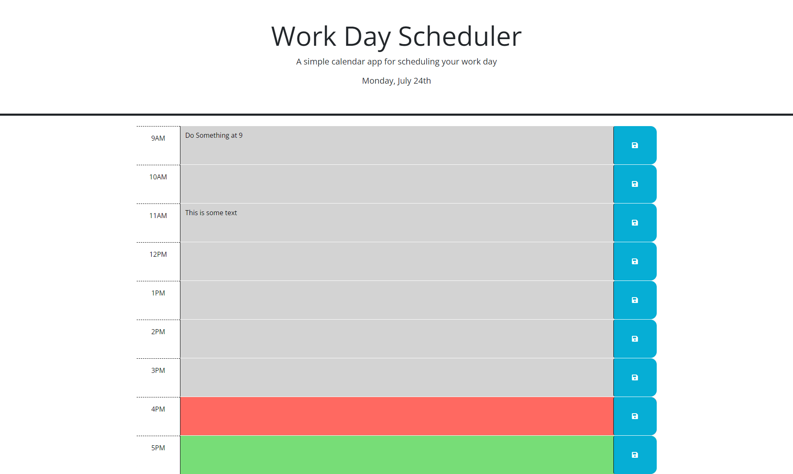

# Mod-5-Work-Day-Scheduler

## Description

The starter code included a page showing samples of each hour as well as the header.  Starter code also included CSS styiing sheet. Removed the samples form the HTML and created the elements in JS.  These elements list a 9AM to 5PM work day and has text areas where the user can type in and save items for their day. The current hour of the day is shown in red and future times are green. Once saved, the data entered will persist until overwriten and saved again. 

## Installation

N/A - Project is deployed to https://tannernd.github.io/Mod-5-Work-Day-Scheduler/

## Usage

The following image shows the web application's appearance and functionality:

## Credits

Created from starter code that was provided.

## License

N/A
